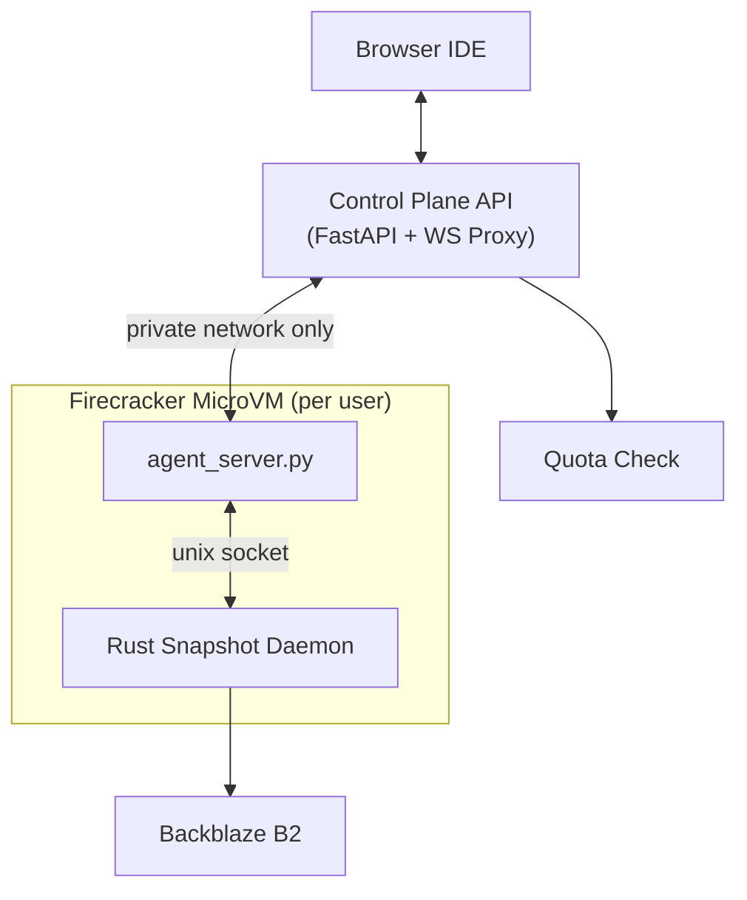

# CodePilot Workspaces

Quick disambiguation because I keep confusing people with the name: **CodePilot** (the `pip install codepilot-ai` one) is the actual agentic runtime — a library you can embed in your own project. **CodePilot Workspaces** is the thing in this repo: a cloud IDE built around that runtime so people can actually poke at the agent in a browser instead of just reading about it in a README somewhere.

Every workspace is its own Firecracker microVM. Not a shared container, not a namespace trick — an actual isolated machine per user, spun up on demand and thrown away when nobody's using it.

## Backend (`/backend`)

FastAPI service that acts as the control plane. It doesn't run any user code itself — it just decides what happens to the machines.

- Provisions, suspends, and destroys microVMs as people show up and leave.
- Proxies HTTP/WebSocket traffic from the browser into the right workspace, so the frontend never talks to a machine directly.
- Suspends anything idle, because I'm paying for this out of pocket, not VC money.
- Enforces usage quotas (more on that below).

## Runner (`/runner`)

The image that actually gets booted per user. This is where the agent lives.

- `agent_server.py` runs the agent runtime and talks to the frontend over a Unix domain socket — local, no network hop, so it's fast and there's nothing to eavesdrop on.
- A small Rust daemon handles filesystem snapshotting. It's a precompiled binary baked straight into the image, not a script wrapping some CLI tool, so it's basically as fast as this kind of thing gets. It watches the workspace and syncs to Backblaze B2 in the background, which is what lets a machine die and come back later without anyone losing their work.
- Aside from code-server, the entire runner image comes in under 100MB. code-server alone is the fat one at 800MB+ — everything else is a rounding error next to it.

## Security

Workspaces are not reachable from the public internet at all — the only way in is through the web API, full stop. Under the hood every machine sits on a private network, so workspace-to-control-plane traffic never actually touches the open internet in the first place.

Runtime credentials (LLM API keys, etc.) are handled so they're usable by the agent runtime but never exposed anywhere a user's terminal or process tree could read them. I'm intentionally not explaining exactly how — figuring that out is left as an exercise for anyone curious enough to try breaking it.

## Fair use / quota

This is a portfolio project, not a hosted product, so I've capped it: **3 hours of workspace time per day, for 30 days**, per environment. If you like it and want to actually use it for real, self-host it — it deploys cleanly onto anything that gives you Firecracker microVMs and per-machine private networking (AWS bare-metal EC2 works, though you're on your own for the orchestration layer that comes free here).

## Architecture

## Deploying it

Backend and runner deploy as two separate services onto the infrastructure. Runner gets built and pushed as an image; the backend pulls it fresh every time it provisions a new workspace. Nothing exotic — if your platform gives you Firecracker VMs and private networking between them, this maps over pretty directly.